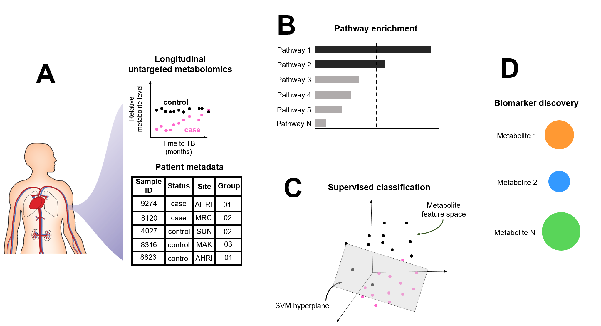

# Metabolic profiling of TB-exposed patient cohort predicts progressor status (20.440J Project)

## Project Overview
This repo contains all the code and data necessary to reproduce analyses from our 20.440 project entitled: "Metabolic profiling of TB-exposed patient cohort predicts progressor status." The goal of this study was to extract biomarker combinations using metabolomics data obtained from TB-exposed individuals who participated in the Grand Challenges in Global Health GC6-74 project (Weiner et al. 2018). This data set consists of 751 case-control matched samples from TB-exposed patients with corresponding metadata.

Various unsupervised and supervised machine learning methods are used in order to glean underlying metabolic patterns that can distinguish between TB-progressors and healthy individuals. We implement RandomForest and support vector machines (SVMs) with optimized hyperparamters and different kernel architectures (i.e., linear vs. radial basis function kernel) to predict progressor status from relative metabolite abundances. By using a sparse subset of metabolite features to construct these models, we uncover how TB-progression surreptitiously manifests in subtle metabolite-level changes that cannot be captured by conventional biomarker detection methods.

This work was conducted by Cal Gunnarsson and Miguel Alcantar.

Graphical abstract:

## Repo structure and folders

### Data
All data used and generated during the analysis can be found in the <code>data</code> folder. This folder contains three main subfolders: 

* <code>data/models</code>
   * Contains all machine learning models (RandomForest, linear-kernel SVM, and RBF-kernel SVM)
      * All models are in pickle format
* <code>data/analysis</code>
   * Contains data tables summarizing all results (e.g., metrics used for model evaluatuion like median accuracy)
* <code>data/external</code>
   * Metabolomics data files used to conduct analysis. These data can be found on Metabolomics Workbench (project: PR000666) and in previous publicaitons (Weiner et al. 2018).

The main external data files used to conduct analysis are:
* <code>measurements_plasma_full.csv </code>
    * Metabolomics measurements obtained from patient plasma -- this data is raw and not standardized
* <code>measurements_serum_full.csv </code>
    *   Metabolomics measurements obtained from patient serum -- this data is raw and not standardized
* <code>measurements_plasmarpmi_full.csv </code>
    *  Metabolomics measurements obtained from patient samples diluted in RPMI (this was done anytime enough sample for mass spectrometry could not be colleted -- this data is raw and not standardized
* <code> biochemicals_full_list_5.csv</code>
    * Mapping between mass spectrometry identifier to actual biochemical name(e.g., M.11777 to glycine). Additional data includes HMDBs (manually curated for some), associated biochemical pathway, and mass-spec mode used to capture the metabolite (e.g., GC/MS) 

### Scripts
The scripts used to conduct preliminary analyses can be found in the folder entitled <code>notebook</code>. The scripts used to conduct the final analyses can be found in the folder entitled <code>src</code>. 

Primary makefile scripts include:
* <code>clean_data</code>
    * Concatenates metabolomics data files (measurements_plasma_full, measurements_serum_full, measurements_plasmarpmi_full) and preprocesses data
    * Data preprocessing consists of quantile-standardization with respect to metabolites (Amaratunga and Cabrera 2011; Bolstad et al 2003). Metabolites were removed if greater than 10% of values were missing. Otherwise, data were imputed as the minimum
* <code>train</code>
   * Trains linear and RBF SVM using the full data set. 
      * this includes conducting a hyperparamter search to optimize the generalization capabilities of our model
   * The output of this script should be a trained linear and RBF SVM with optimized hyperparameters
* <code>pred</code>
   * Applies trained SVMs to the full data set in order to classify TB-progressors vs. healthy controls
   * The output of this script should be ROC and PR curves with associated confidence intervals
Individual analyses can also be run using the following scripts:
* <code>figs</code>
   * Creates ROC and PR curves used to asses models
### Figures
All raw figures can be found in the <code>fig</code> folder. Final figures can be found in the <code>fig_final</code> folder.

## Reproducing results

### Installation

This directory and associated dependencies can be run by typing the following into command line / terminal:
~~~
conda create -n tb-omics python=3.7
source activate tb-omics
conda install pip
pip install -r requirements.txt
~~~

### Rerun analysis 

The command <code>make</code> will rerun all analysis, including reproducing figures.
